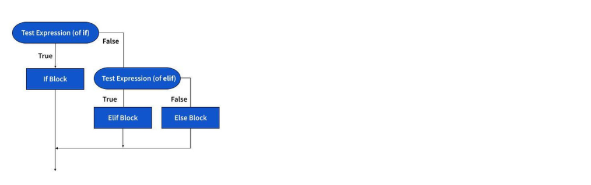

# Introduktion til Python

Programmering B, 2.r, Slotshaven Gymnasium 2024-25.

Vi bruger Python til at lære programmering.  
Python 3.1.12 er den nuværende version.

## Forløb 1: Oversigt
Vi skal lære om:

- indrykning (indentation)
- blokke
- simple datatyper som heltal, tekst og sand-falsk
- simple test som if, if-else og if-elif-else
- løkker (loops) med for-in, range()
- lister - som fx `[1, 2, 3]`
- funktioner

Vi skal bruge følgende værktøjer og programmer:

- en kodeeditor (IDE)
- en kommandolinje (CLI)
- Python 3

&#x24D8; **IDE** er et akronym for _Integrated Development Environment_. Altså, en kodeeditor, det program som vi skriver vores programmer i. Vi bruger VS Code som er en IDE fra Microsoft.

&#x24D8; **CLI** betyder *command line interface* (altså kommandolinjegrænseflade) og er et andet meget brugt _TLA_.

Joke: hvad er et [TLA](https://en.wikipedia.org/wiki/)?

### VS Code
Som en snedker har sit træværktøj, har du din kodeeditor. Brug tid på at lære den at kende!  Se fx [denne video](
https://code.visualstudio.com/docs/introvideos/productivity) med tips og tricks.
Eller [denne her](
https://code.visualstudio.com/docs/introvideos/configure) om temaer.

⚠️ Om et par måneder skal du som minimum kende denne genvej <kbd>Space</kbd> + <kbd>Ctrl</kbd> + <kbd>P</kbd> (Mac: <kbd>Shift</kbd> + <kbd>&#x2318;</kbd> + <kbd>P</kbd>) - den giver direkte adgang til ALT hvad man kan i VS Code. Prøv den nu.

### Python CLI
Når man arbejder med på kommandolinje, betyder det at man skriver kommandoer på en kommandolinje. 
Eksempel: når vi skriver 

```
>python3 main.py
```

så arbejder vi med Python i CLI.

De tegn som står i begyndelsen af linjen, fx `>>>`, kaldes i øvrigt en prompt. 

Hvis man skriver 
```
python3
```
i sit CLI, starter man python og kan derefter "tale med" python. Så er man i _interactive mode_.
Det kan ses på prompten som ser sådan ud: `>>>`. 

For at afslutte "samtalen" skriv `quit()`.

Hvis man vil have python til at afvikle et program som man har gemt i en fil, skriver man 
```
python3 mit-program.py
```
Her afvikler python programmet i filen og stopper derefter.
En typisk fejl er at glemme om man befinder sig "inde i python" eller udenfor.

## Variabler
Hvad er en variabel? Vi kender dem måske fra matematik, når vi beregner resultat af en funktion.
```
y = f(x)
```
Her beregner vi funktionen af `x` og gemmer værdien som `y`.

i python skriver vi fx
``` python
school = "Slotshaven"
classname = "2r"
student_count = 11
htx = True
hhx = False
```

En variabel er altså "et navn med en værdi". Navnet kan ikke ændre sig. En variabel hedder altid det samme.
Hvis den hedder noget andet, er det en anden variabel. Værdien derimod - den kan ændre sig.

``` python
student_count = 11
print(student_count) // 11
student_count = 10 // Nogen er kommet for sent
print(student_count) // 10
```

Variabler har _datatyper_. Typer kan være simple eller komplekse. 
Vi begynder med de simple typer:

- streng (tekst)
- integer (heltal)
- boolean (sandt eller falsk)

De komplekse typer er fx lister af forskellig art, men det kommer vi til.

``` python
age = 11 # heltal (integer)
name = "Peter" # tekst (string) 
is_htx = True # sandt/falsk (boolean)
has_car = False # do.
```
Som programmør er det dog meget vigtigt at vide hvilken type en variabel har, da det har betydning for hvilke operationer som man kan udføre med variablen.

Man kan komme galt afsted hvis man ikke har styr på det.

``` python

# name er et heltal - hvilket er underligt men ok ...
name = 15
# men dette er ikke okay ...
name = name.capitalize() # ERROR!
# AttributeError: 'int' object has no attribute 'capitalize'
```
Man kan ikke gøre et heltal til et stort bogstav.

Men man må gerne skifte en variabel type - Python er ligeglad - men lad være med det.

``` python
name = 15 
name = 'anna' # nu er name faktisk et navn
name = name.capitalize() # Anna
```

&#x24D8; Datatyper er et MEGET vigtigt begreb i programmering, men det er også et meget stort emne så det vender vi tilbage til.


## if og if-else og if-elif-else

`if` og dens varianter er måske den mest basale alle såkaldte kontrolstrukturer - den bestemmer hvilken 
retning programmet skal løbe i. Det gør den ved at afgøre sandhedsværdien i en given test. 

``` python
name = "Peter"
if name == "Peter":
    print("Hej Peter") # Hej Peter
```
Testen afgører om variablen `name` er sat til "Peter" - hvilket jo enten sandt eller falsk.
Men hvad skal der ske hvis navnet ikke er "Peter"?
Så bruger man `else` - det bliver udført hvis testen evaluerer til falsk.


``` python
name = "Peter"
if name == "Peter":
    print("Hej Peter") # Hej Peter
else:
    print("Hej X") # Du hedder ikke Peter

```
`else` er altså det som sker, hvis alt andet er falsk - det er en slags default.  
Hvis der også er en Søren, kan man bruge "else-if" som i Python hedder `elif`.

``` python
name = "Henrik"
if name == "Peter":
    print("Hej Peter") # navnet er Peter
elif name == "Søren":
    print("Hej Søren") # navnet er Søren
else:
    print("Hej X") # Du hedder hverken Peter eller Søren

```
Nu har vi altså to tests og en default. Det ser sådan ud:




Bemærk at rækkefølgen af tests har betydning. Betragt:

``` python
age = 19
if age > 18
    print("Du er gammel nok til kørekort") 
elif age > 90 # bliver aldrig sand - hvorfor?
    print("Du er for gammel til kørekort") 
else:
    print("Du er for ung til kørekort")
```
Tænk over hvorfor test 1 og 2 bør skifte rækkefølge.


## Loops med range()

Funktionen [`range()`](https://docs.python.org/3.12/tutorial/controlflow.html#the-range-function) er et loop, altså en kontrolstruktur som udfører en løkke. 
Den gentager altså blokken der følger efter så mange gange som man beder den om. 
Antallet af gentagelser kaldes også _iterationer_. 

Den tager tre parametre - start, slut og hop (_increment_ eller _step_).
Men - hvis man bare vil tælle op et tal ad gangen, behøver man kun et parameter - nemlig slut-parameteret.
I det tilfælde er start lig med 0 og hop lig med 1 (første eksempel).
Det vil sige at funktionen har default-værdier for start og hop (nemlig 0 og 1), hvis man ikke angiver nogle værdier.

``` python
for i in range(10):
  print(i) # 0 1 2 3 osv. op til 9

for i in range(3, 13):
  print(i) # 3 4 5 osv op til 12

for i in range(0, 20, 2):
  print(i) # 0 2 4 6 .. op til 18

for i in range(25, 10, -2):
  print(i) # 25 23 21 19 17 15 13 11
```

> &#x24D8; What!? `range(10)` tæller fra 0 til 9! Bemærkede I det? Dataloger er underlige når de tæller - de begynder med 0. Lev med det indtil videre.

Konklusion: `range()`-funktionen er praktisk hvis man på forhånd kender antallet af iterationer eller skal bruge en liste af tal. 

Der er andre typer loops - men først kigger vi lige på lister.

## Lister
Lister er en helt grundlæggende struktur i programmering. I andre sprog kaldes de også _arrays_.

I python er der fire forskellige typer lister:
- liste (_list_)
- sæt (_set_)
- tupel (_tuple_)
- dictionaries

For nu koncenterer vi os om den første type og glemmer de andre et stykke tid.

Vi begynder med lister først. En liste kan kendes på sine kantede parenteser.
```
students = ['Peter', 'Anna', 'Pernille']
```


### Operationer på lister

Der er en række basale ting som ofte gerne vil gøre med en liste: tilføje, fjerne, opdele osv. 

Man kan tilføje elementer til en liste med `append()`.
``` python
students = ['Peter', 'Anna', 'Pernille'
students.append('Henrik') # tilføj Henrik
```

Man kan fjerne elementer til en liste med `remove()`.
``` python
students = ['Peter', 'Anna', 'Pernille'
students.remove('Peter') # fjern Peter
```

Man kan tilgå listens enkelte elementer via dets _indeks_. 
Indeks angives i kantede parenteser, altså `[]`.

Sådan finder man fx det første og sidste element i en liste.
``` python
students = ['Peter', 'Anna', 'Pernille']
first = students[0] # Peter
last = students[-1] # Pernille
```

En meget anvendt og kraftfuld på lister er _splice_, eller deling, af lister.
Hertil bruger man `[:]`, _the splice operator_. Den returnerer en _substring_, eller delstreng, af en liste.
Vi kan dele listen i drenge og piger således:
``` python
students = ['Peter', 'Anna', 'Pernille']
boys = students[0:1] # Peter
girls = students[1:2] # Anna Pernille
```

Forklaring på slice-operatoren:
> The slice operator [n:m] returns the part of the string starting with the character at index n and go up to but not including the character at index m.

I `[n:m]` refererer `n` og `m` altså til listens indeks. MEN - den begynder
med indeks `n` og tæller op til `m` _men tager ikke tegnet på indeks m med!_

Hvis man udelader et indeks, betyder det hhv. fra begyndelsen af listen eller til slutningen af listen.
Derfor får vi 
``` python
students = ['Peter', 'Anna', 'Pernille']
# Fra begyndelsen af listen til men ikke med indeks 1!
boys = students[:1] # Peter
# Fra indeks 1 til slutningen af listen
girls = students[1:] # Anna Pernille
```

Hvad skete der lige der? Dette er Python-magi. 
Man kan udrette meget med `[:]`.


En underlig ting er **kopiering** af lister - det gøres med den tomme parentes, således:
``` python
students = ['Peter', 'Anna', 'Pernille']
copy_of_student = students[:]
```

Længden af en liste findes med `len()`.
``` python
num_students = len(students)
```

Sortering sker med `sort()`.
``` python
students.sort()
```

Vi kan også vende den om.
``` python
students.reverse()
```

### Loops igen - nu med lister
Lad os kigge på loops igen - nu med lister. Vi looper igennem lister med strukturen `for-in`.

Den har formen `for X in LISTE:` hvor `for` og `in` er reserverede ord.
X er en variabel som får værdien af et nyt element i listen for hver gang vi gentager løkken.

``` python
for code in ['python', 'c#', 'html']:
  print(code) # python c# html

for code in ['python', 'c#', 'html']:
  # Vi vil kun have python
  if code == "Python":
    print(code) # python

code_languages = ['python', 'c#', 'html']
# Man kan også tælle sig igennem en liste via indeks.
for i in range(3):
  print(code_languages[i]) 
```

### test med lister

Ofte vil man gerne vide om en liste indeholder et bestemt element.
Det kan gøres nemt med `if` og `in`.

``` python
languages = ['python', 'c#', 'html']
if 'python' in languages:
  print('vi har python i vores liste!')

numbers = [1, 3, 5, 7, 9]
if 3 in numbers:
  print('3 fundet') 

```

## Reserverede ord
Programmeringssprog har _reserverede ord_. Det er ord som programmøren ikke må bruge som variabelnavne. 

Andre reserverede ord i Python er fx
``` python
for in if elif else True False
```

I Python må man ikke kalde sin liste for `list`. Kan I regne ud hvorfor? 

&#x261E; Det er en datatype.

## Funktioner 
Som I måske har bemærket, bliver et program meget hurtigt uoverskueligt. Det er tid til at modularisere det.
Det kan man gøre på flere måder, men vi begynder med at opdele vores kode i _funktioner_. 

Der er en række ting at sige om en funktion så hold nu fast: 
 - Man kan altid kende en funktion på parenteserne - `funktion()`. 
 - En funktion har eller kan have parametre.
 - En funktion har en returværdi. 
 - En funktion definerer sit eget virkefelt (_scope_) (det vender vi tilbage til)).

Uden at vide det, har vi allerede brugt funktioner - nemlig Pythons indbyggede funktioner som fx `print()`.
Man skelner altså Pythons _egne_ funktioner - de såkaldte [_built-in functions_](https://docs.python.org/3/library/functions.html) - og de funktioner som man selv definerer.

En funktion erklærer man i python med det reserverede ord `def`.
``` python
def add_item_to_grocery_list(item):
  grocery_list.append(item)
```  
Det er som vi kender det fra Python - alt hvad der følger efter kolon (`:`) og er _indrykket_ under funktionen, er kode som tilhører funktionen. 

Variablen `item` i ovenstående eksempel kaldes et parameter. Det er den data som man giver til funktionen.  
Husk at funktion en funktion kan kendes ved `()` - så de skal med, selv om funktion ikke har parametre.

``` python
from datetime import date

def print_date():
    """ Denne funktion har ingen parametre """
    today = date.today()
    print("Today's date:", today)
```  

Funktioner er den vigtigste byggesten i programmering. Man bruger først og fremmest funktioner til "pakke kode ind" som
skal løse små, afgrænsede problemer igen og igen. 

Næste vigtige punkt er at man kan _generalisere_ løsningen på et problem ved hjælp af funktioner.
Hvis man fx har en mail-funktion, kan man fx bruge email-adresse som parameter. 

``` python
def send_welcome_mail(mail):
    """ Denne funktion sender en velkomst mail """
    # send welcome mail til "mail".
```  
I dette tilfælde har man lavet en `generel` funktion som kan sende velkomst-mails til en mail-adresse fordi man kan angive mail-adressen som et parameter til funktionen.

Denne kode printer Fibonacci-tal op til 100.
``` python
a, b = 0, 1
while a < 100:
    print(a, end=' ')
    a, b = b, a+b
```  
Men hvorfor lige tallet 100? Det er et helt tilfældigt tal. Hvorfor ikke gøre 100 til et parameter og lave en generel funktion? Lad os udskifte 100 med et parameter ved navn `limit`.

``` python
def fib(limit):
    a, b = 0, 1
    while a < limit:
        print(a, end=' ')
        a, b = b, a+b
    print()
```

Kør denne funktion i VS Code. Men hov - den gør jo ikke noget. 

Hmm, en funktion skal kaldes.

``` python
fib(25) # calling fib()
# 0 1 1 2 3 5 8 13 21 
```

Funktioner anvendes som sagt til afgrænsede, enkeltstående opgaver.
Nogle kloge folk siger, at som udgangspunkt skal man kunne overskue hele funktionen i et skærmbillede. 

### Dokumentation
Der findes en Python-standard til dokumentation af funktioner.
En 1-linjes tekst lige under funktionshovedet. Fx kunne vores fibonacci-funktion dokumenteres sådan her: 

``` python
def fib(limit):
    """Print a Fibonacci series up to limit."""
    a, b = 0, 1
    (...)
```


### Mere om parametre
En funktion kan selvfølgelig have mere end et parameter. Faktisk kan en funktion have et stort set uendeligt antal parametre. 

Der er en dog en tommelfingerregel som  siger at hvis en funktion har flere end 3-4 parametre, så skal man overveje om ens funktion er for indviklet. 


``` python
def say_hello(greeting, title, name):
    print(greeting, title, name)

say_hello('Hej', 'hr.', 'Jensen') # Hej hr. Jensen
say_hello('Goddag', 'fru', 'Hansen') # Goddag fru Hansen
say_hello('Hva så', 'der, ', 'mester') # Hva så der, mester

```

Denne funktion kan synes lidt fjollet. Men det kunne faktisk være meget smart, hcis man senere besluttede sig for at ændre på den måde som man hilser på. Så ville man kun skulle ændre koden et sted. Vi kan fx gøre brug af Pythons indbyggede formateringsmuligheder:

``` python
def say_hello(greeting, title, name):
    print(f"Sig {greeting} til {title} {name}") # Sig Hej til hr. Jensen
```

### Parametre eller argumenter? 
En funktion har altså _parametre_. Et _argument_ er den værdi som man _kalder_ funktionen med.
I eksemplet ovenfor er parametrene altså `greeting`, `title`, `name` - og "Hej", "hr.", "Jensen" de tre argumenter som funktionen bliver kaldt med.

### Position eller keyword?
Det ses i eksemplet, at rækkefølgen er vigtig. 
Disse to funktionskald er ikke ens - prøv selv:

``` python
say_hello("Hej", "hr.", "Jensen")
say_hello("Jensen", "hej", "hr")
```
Det er fordi argumenterne er _positionelle_, altså rækkefølgen er afgørende.
Det kan man faktisk komme uden om ved at navngive sine argumenter efter parametrene: 

``` python
say_hello(name = "Jensen", greeting = "hej", title = "hr")
```
Det kaldes _keyword_-argumenter, eller navngivne argumenter. Det har måske ikke den store praktiske betydning lige nu. Men man skal være opmærksom på reglerne.

Kombinationer af positionelle og navngivne argumenter kan hurtigt give problemer.
``` python
say_hello("Jensen", greeting = "hej", title = "hr")

TypeError: say_hello() got multiple values for argument 'greeting'
```
Eller
``` python
say_hello(name = "Jensen", greeting = "hej", "hr")
SyntaxError: positional argument follows keyword argument
```

### Default-værdier
Noget mere interessant er måske default-værdier for parametre.

``` python
def animals_greeting(greeting, first_animal = "cat", second_animal = "dog"):
    print(f"The {first_animal} says {greeting} to the {second_animal}.")

animals_greeting("hello", "bird", "mouse")
# men også
animals_greeting("hello") # The cat says hello to the dog
```
Igen er rækkefølgen vigtig: Reglen er at parametre med default-værdier skal komme efter parametre uden default-værdier.

Dette går ikke:
```python
def animals_greeting(first_animal = "cat", second_animal, greeting):
    # define function here

SyntaxError: parameter without a default follows parameter with a default
```

Default-værdier giver mening hvis man _næsten altid_ kalder en funktion med de samme værdier - hermed fortæller man at visse værdier er normaltilfældet.

``` python
def print_document(document, all_pages = True, use_duplex = True):
    """ By default, prints full doc as duplex """
    # Print your document here


print_document(document) # using default values for 2nd and 3rd argument
```
Det betyder, at man i de fleste tilfælde kan udelade andet og tredje argument, hvis man bare ønsker at printe _hele_ dokumentet som _duplex_.

Når kalder bruger `return` så forlader eksekveringen funktionen og vender tilbage til kaldet.


### Returværdier
En funktion kan returnere en værdi med `return`-nøgleordet.

``` python
def calculate_age(date_of_birth):
    """ Calculates and returns age by comparing current date with date_of_birth """
    # Do the calculation
    return age
```

#### Returværdien None

``` python
def pretty_print(message):
    """ Pretty prints message """
    print(f"Message: {message}")

return_value = pretty_print("This is Public Service Announcement")

print(f"Returværdi: {return_value}")
--
None
```


#### Multiple returns
Man kan sagtens "returnere" flere gange i samme funktion.

``` python
def determine_vehicle(num_wheels, has_motor):

    if not has_motor and num_wheel == 2:
        return ["bike"]

    if has_motor and num_wheel == 2:
        return ["mc", "scooter"]

    if has_motor and num_wheel == 4:
        return ["car", "atv"]

    if has_motor and num_wheel > 4:
        return ["truck"]
```


I dette eksempel returnerer vi en værdi ligeså snart vi har fundet den. Det kaldes _early return_. 
Princippet er at man finder de nemmeste løsninger først og dermed reducerer kompleksiteten i antallet af kombinationer.
Fordelen ved dette er at man kan holde funktionen simpel - man behøver ikke så mange betingelser og indrykninger.

Der findes en modsat skole - _one exit only_ - som mener at man kun skal returnere en gang til sidst i funktionen. 

Sammenlign disse eksempler:

Early return
``` python
if (condition)
   return 42;
else
   return 97;
```

"One exit point"
``` python
int result;
if (condition)
   result = 42;
else
   result = 97;
return result;
```

Se også [denne tråd på StackExchange](https://softwareengineering.stackexchange.com/questions/118703/where-did-the-notion-of-one-return-only-come-from).


Jeg foretrækker den første løsning.


## Import af biblioteker

### Import
I store programmer vil man opdele koden i flere filer som man så _importerer_ i sit hovedprogram. Hvis man gerne vil bruge sin indkøbsliste-kode, kan man importere en fil således:
```
import grocery-list
```

Det kræver at python ved hvor koden ligger.